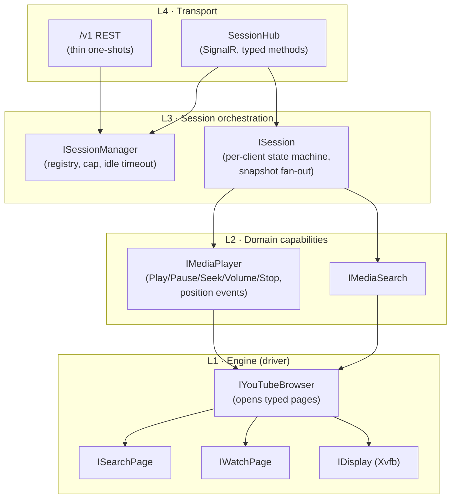
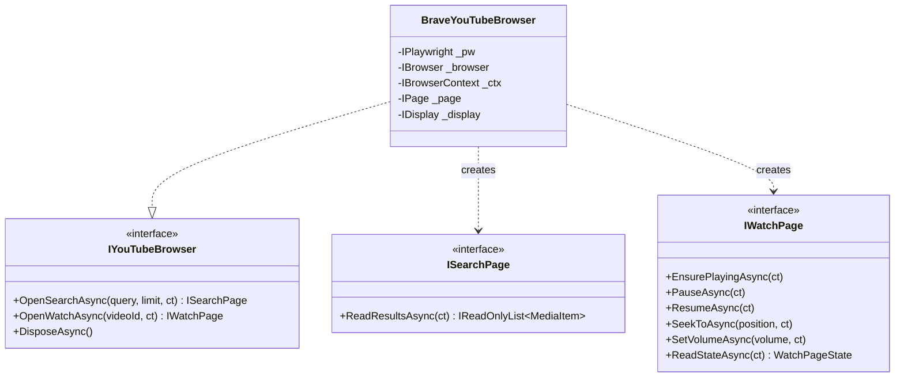
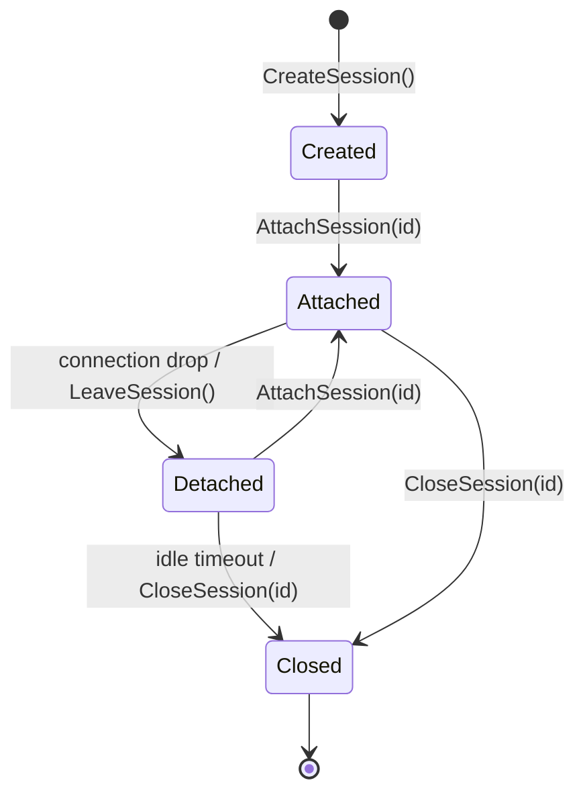
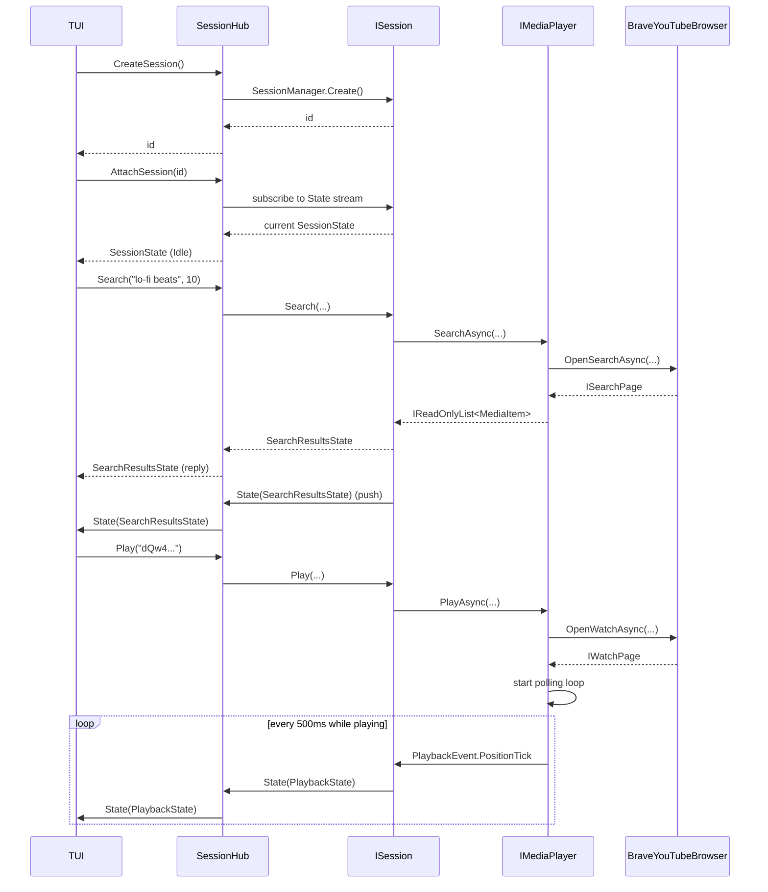
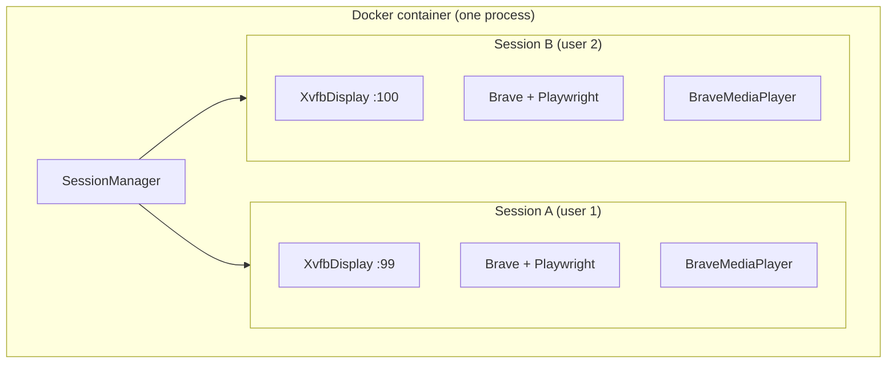
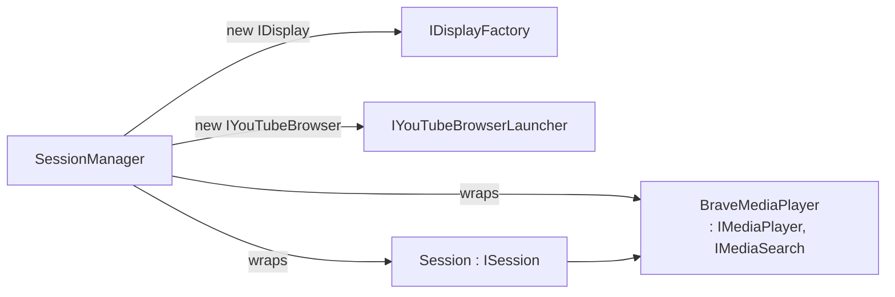
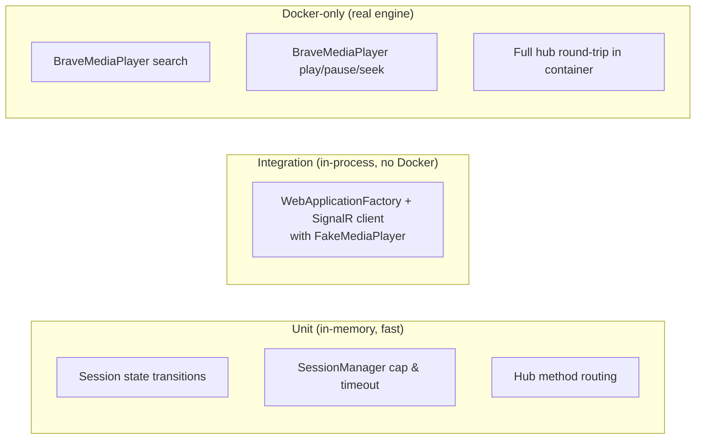

# BluKube Server — Clean Design

A focused design for the server side of BluKube. Goals:

- Small, single-purpose components.
- Clear seams for unit tests (no Playwright in domain layer) and Docker-only integration tests (real Brave engine).
- Stateful, session-oriented: the TUI is a dumb renderer; the server owns truth.
- **Per-session engine isolation**: each session owns its own Brave + Xvfb + Playwright instance. Multiple concurrent users never share a browser tab.
- Extensible: adding a new YouTube surface (e.g. channel browsing) doesn't ripple through unrelated layers.
- No language-preview ceremony (no `union`, no `static abstract` page factories).

---

## 1. Layered architecture

Four concentric layers. Lower layers know nothing about higher ones. Each layer has exactly one reason to change.



### What each layer owns

| Layer | Owns | Knows about |
|---|---|---|
| L1 Engine | Playwright, Brave, Xvfb, DOM scripts, page navigation | Nothing above |
| L2 Domain | Verbs (`PlayAsync`, `SearchAsync`), polling cadence, error mapping to domain errors | L1 |
| L3 Session | Session identity, lifecycle, snapshot fan-out, optional queue, idle timeout | L2 |
| L4 Transport | SignalR contract, auth, group membership, REST endpoints | L3 |

The **testable seam** is L2. Hub and session logic test against fakes implementing `IMediaPlayer` / `IMediaSearch`. Real Brave is exercised only by Docker-only tests at L1/L2.

---

## 2. Engine layer — page abstraction without ceremony

We keep a per-page abstraction (so adding channel browsing later doesn't bloat one god class), but drop the `static abstract Create` factory. Pages are plain interfaces returned by the browser. The browser is the only thing that knows about Playwright.



### Adding a new page later

Adding `OpenChannelAsync` is a three-step change confined to L1:

1. Add `IChannelPage` interface.
2. Add `OpenChannelAsync` method to `IYouTubeBrowser` and implement it in `BraveYouTubeBrowser`.
3. Add a `BraveChannelPage` class with its DOM scripts.

Nothing in L2/L3/L4 changes unless you decide to expose the new capability through a domain interface.

### `IPage` lifetime

One Brave context per session, one tab (`IPage`) per session, reused across pages. `OpenSearchAsync` / `OpenWatchAsync` navigate the same tab and return a *thin wrapper* over that tab. The wrapper is valid only until the next navigation — the browser tracks "current page" internally so callers who hang onto a stale wrapper get a clean exception.

---

## 3. Domain layer — `IMediaPlayer` and `IMediaSearch`

These are the **only** types L4 transport code sees. They have no Playwright references.

```csharp
public interface IMediaSearch
{
    Task<IReadOnlyList<MediaItem>> SearchAsync(
        string query, int limit, CancellationToken ct);
}

public interface IMediaPlayer : IAsyncDisposable
{
    Task PlayAsync(string videoId, CancellationToken ct);
    Task PauseAsync(CancellationToken ct);
    Task ResumeAsync(CancellationToken ct);
    Task StopAsync(CancellationToken ct);
    Task SeekToAsync(TimeSpan position, CancellationToken ct);
    Task SetVolumeAsync(float volume, CancellationToken ct);

    Task<PlaybackState> GetStateAsync(CancellationToken ct);
    IAsyncEnumerable<PlaybackEvent> Events(CancellationToken ct);
}
```

`PlaybackState` is the *current* snapshot. `PlaybackEvent` is incremental: `PositionTick`, `Ended`, `Failed`. The polling loop lives **inside** the implementation (`BraveMediaPlayer`), driven by its own `CancellationTokenSource` keyed to "is something currently playing?". Polling stops on `Pause`/`Stop`/`Dispose` — really stops, not just nulls a field.

Both interfaces are implemented by `BraveMediaPlayer`, which composes `IYouTubeBrowser`. They're separate interfaces so:

- A future provider (e.g. SoundCloud) can implement only `IMediaPlayer`.
- Tests can fake one without the other.

---

## 4. Session layer — thin TUI, snapshot push

The TUI is intentionally dumb: it sends typed commands and renders whatever `SessionState` arrives. The session is the state machine.

### State as a sealed record union (no `union` keyword)

```csharp
public abstract record SessionState;
public sealed record IdleState                                : SessionState;
public sealed record SearchResultsState(string Query,
        IReadOnlyList<MediaItem> Items)                       : SessionState;
public sealed record PlaybackState(string VideoId, string Title,
        TimeSpan Position, TimeSpan Duration,
        bool IsPlaying, float Volume)                         : SessionState;
public sealed record ErrorState(string Code, string Message,
        SessionState? Previous)                               : SessionState;
```

`ErrorState.Previous` lets the TUI render an error overlay without losing context — a small affordance that pays off in UX.

### Two channels, not one

The previous prototype mixed command replies and event ticks on a single channel, so a client streaming playback ticks would receive unrelated `SearchResults`. Cleaner split:

| Channel | Purpose | Direction |
|---|---|---|
| Hub method return | Acknowledge a command, surface validation errors | request/reply |
| `StreamState()` | Continuous, eventually-consistent view of `SessionState` | server → client |

Hub methods return `Task` (fire-and-forget) or `Task<SessionState>` for "what does the world look like right after this command". The stream is the source of truth; the reply is a convenience for clients that want a synchronous confirmation.

### Session lifecycle ≠ connection lifecycle

A SignalR disconnect must **not** destroy the session. Reattach is a primary feature.



`SessionManager` enforces:

- `MaxSessions` cap (default 3).
- Idle timeout (no attached client for N minutes → close).
- One Brave + Xvfb per session, disposed on close.

---

## 5. Transport layer — typed hub methods

Drop the `ClientEvent` discriminated union. SignalR has typed hubs; use them.

```csharp
public interface ISessionClient   // server → client
{
    Task State(SessionState state);
}

public class SessionHub : Hub<ISessionClient>
{
    // Lifecycle
    public Task<Guid> CreateSession();
    public Task<SessionState> AttachSession(Guid id);
    public Task LeaveSession(Guid id);
    public Task CloseSession(Guid id);

    // Commands (all require an attached session on this connection)
    public Task<SessionState> Search(string query, int limit);
    public Task<SessionState> Play(string videoId);
    public Task<SessionState> Pause();
    public Task<SessionState> Resume();
    public Task<SessionState> Stop();
    public Task<SessionState> SeekTo(TimeSpan position);
    public Task<SessionState> SetVolume(float volume);

    // Read
    public Task<SessionState> GetState();
}
```

Plus thin REST for scripting / inspection:

| Verb | Path | Purpose |
|---|---|---|
| `GET` | `/v1/sessions` | List sessions |
| `POST` | `/v1/sessions` | Create session |
| `DELETE` | `/v1/sessions/{id}` | Close session |
| `GET` | `/v1/sessions/{id}/state` | Snapshot |
| `GET` | `/health`, `/alive` | Liveness/readiness |

Auth: bearer token middleware applied to `/v1/*` and the hub. Health endpoints stay open.

---

## 6. End-to-end command flow



Reply + push together let clients use either pattern. The TUI subscribes once and renders state pushes; a script can call a single command and read the reply.

---

## 7. Composition root (DI registration)

```csharp
// Engine — singletons / factories per session
services.AddSingleton<IDisplayFactory, XvfbDisplayFactory>();
services.AddSingleton<IYouTubeBrowserLauncher, BraveYouTubeBrowserLauncher>();

// Domain — created per session by the SessionManager, not via DI scope
//   (sessions outlive any HTTP request scope)
// SessionManager is the factory.
services.AddSingleton<ISessionManager, SessionManager>();

// Transport
services.AddSignalR();
services.AddOptions<BluKubeOptions>().BindConfiguration("BluKube");
```

`SessionManager` is the only thing that constructs `BraveMediaPlayer`. It uses the engine factories to build a fresh `IDisplay` + `IYouTubeBrowser` per session, wraps them in `BraveMediaPlayer`, then in `Session`, and registers the result.

Engine resources are **owned by the session, not the process**. Two users issuing `CreateSession()` get two completely independent engines:



Implications this drives:

- `XvfbDisplayFactory` must hand out unique display numbers (`:99`, `:100`, …). The factory tracks used numbers and recycles them on session close.
- Each Brave gets its own user-data dir under e.g. `/tmp/blukube/<sessionId>/`, cleaned up on dispose.
- `MaxSessions` exists primarily as a resource cap (each Brave is ~200 MB RAM); it is not a single-user assumption.
- A failure in one session's engine (Brave crash, Playwright timeout) marks that session `ErrorState` and disposes its resources — it never affects other sessions.



---

## 8. Testing strategy

Three test tiers. Each tier has a distinct purpose; nothing leaks between them.



### Fakes

- `FakeMediaPlayer : IMediaPlayer, IMediaSearch` — scripted events on a `Channel<PlaybackEvent>`, deterministic search results. Tests inject scenarios.
- `FakeYouTubeBrowser` — only used by lower-level engine tests if needed; most code tests against `IMediaPlayer` directly.

### `DockerOnlyFactAttribute`

Already in the repo. Skips when not running in the BluKube container image (detected via env var or marker file). Docker-only tests:

- Take real wall-clock time (a few seconds each).
- Use a **stable, short, license-safe** test video (a Creative Commons clip on YouTube — pinned via env var so it can be swapped).
- Assert behavioural invariants (state goes from `Paused → Playing`, position advances), never exact pixel/timing values.

---

## 9. Folder layout

```
src/BluKube.Server/
  Program.cs
  Hubs/
    SessionHub.cs
    ISessionClient.cs
  Core/
    Engine/
      Browser/
        IYouTubeBrowser.cs
        ISearchPage.cs
        IWatchPage.cs
        BraveYouTubeBrowser.cs
        BraveSearchPage.cs
        BraveWatchPage.cs
        IYouTubeBrowserLauncher.cs
        BraveYouTubeBrowserLauncher.cs
      Display/
        IDisplay.cs
        IDisplayFactory.cs
        XvfbDisplay.cs
        XvfbDisplayFactory.cs
    Domain/
      MediaItem.cs
      IMediaSearch.cs
      IMediaPlayer.cs
      PlaybackEvent.cs
      BraveMediaPlayer.cs
    Session/
      ISession.cs
      Session.cs
      ISessionManager.cs
      SessionManager.cs
      SessionState.cs
  Configuration/
    BluKubeOptions.cs
```

Notes on changes from current layout:

- `Core/Search/` and `Core/Playback/` collapse into `Core/Domain/` (one folder per layer, not per feature) plus engine pages under `Core/Engine/Browser/`. Search and playback aren't separate layers — they're separate verbs at the same layer.
- `UnionShim.cs` is deleted.
- `Core/Session/ClientEvent.cs` is deleted; its types are replaced by typed hub methods.

---

## 10. Open questions / explicit non-goals

Captured so we don't accidentally design for them:

- **Queue management** stays inside `Session` for now (Enqueue/Next/Prev). Not in `IMediaPlayer` — the player plays one thing at a time. Revisit if a non-Brave player gains native queueing.
- **Multiple clients per session**: allowed (group membership in SignalR). State pushes broadcast to the whole group. No per-client view yet.
- **Multiple sessions per server**: this is the headline feature. Each session = one user = one isolated `IDisplay` + `IYouTubeBrowser` + `IMediaPlayer`. They share nothing but the host process. `MaxSessions` (default 3) caps the total based on container resources, not because the design assumes one user.
- **Persistence**: out of scope. Sessions die with the container.
- **HTTPS / TLS**: out of scope; reverse-proxy concern.
- **Authn beyond shared token**: out of scope.

---

## 11. Migration plan from the current code

Mechanical, low-risk order:

1. Delete `UnionShim.cs` and the `union` keyword usage.
2. Replace `ClientEvent` hierarchy with typed hub methods. Replace `SessionSnapshot` union with the sealed-record `SessionState` hierarchy.
3. Refactor `IYouTubeBrowser` to expose `OpenSearchAsync` / `OpenWatchAsync`. Delete `IYouTubePage<TParams>` and the `static abstract Create` pattern. Move `YouTubeSearchPage` / `YouTubeWatchPage` behind `ISearchPage` / `IWatchPage`.
4. Extract `BraveMediaPlayer : IMediaPlayer, IMediaSearch` from the current `BrowserSession`. Move polling into the player with a real, cancellable token.
5. Reduce `Session` to: hold a `SessionState`, fan out to subscribers via `Channel<SessionState>`, translate `PlaybackEvent` → state updates, delegate commands to player/search.
6. Split `SessionHub.Connect()` into `CreateSession` / `AttachSession`. Stop killing sessions on disconnect.
7. Add `MaxSessions` and idle timeout to `SessionManager`.
8. Add `FakeMediaPlayer` and the first `Session` unit tests.
9. Add the first Docker-only `BraveMediaPlayer` test.

Each step is small enough to land as its own commit and keeps the project building.
