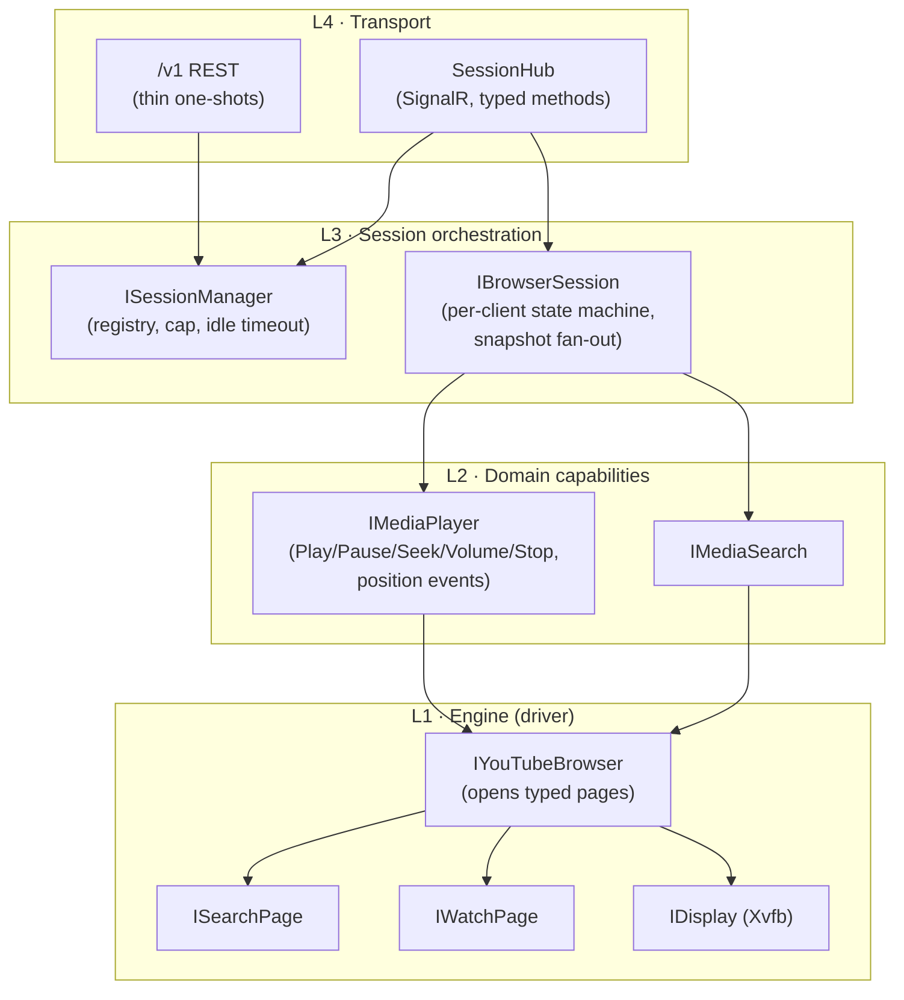
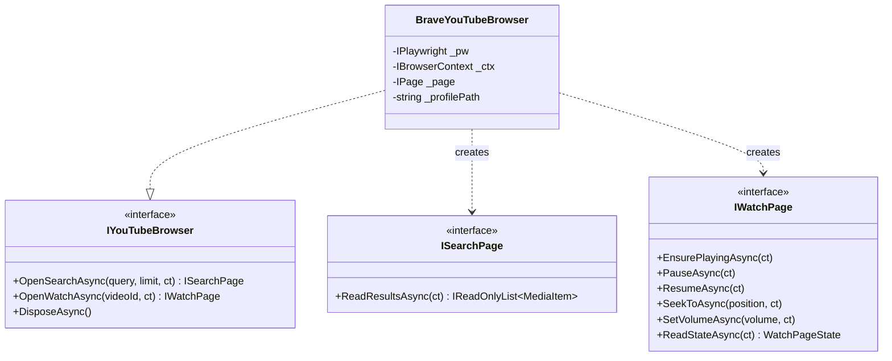
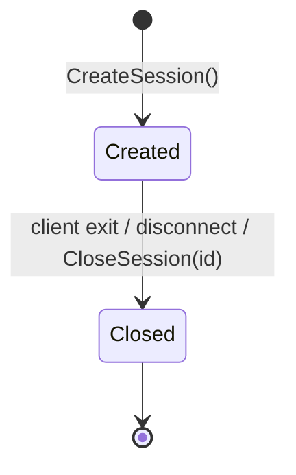
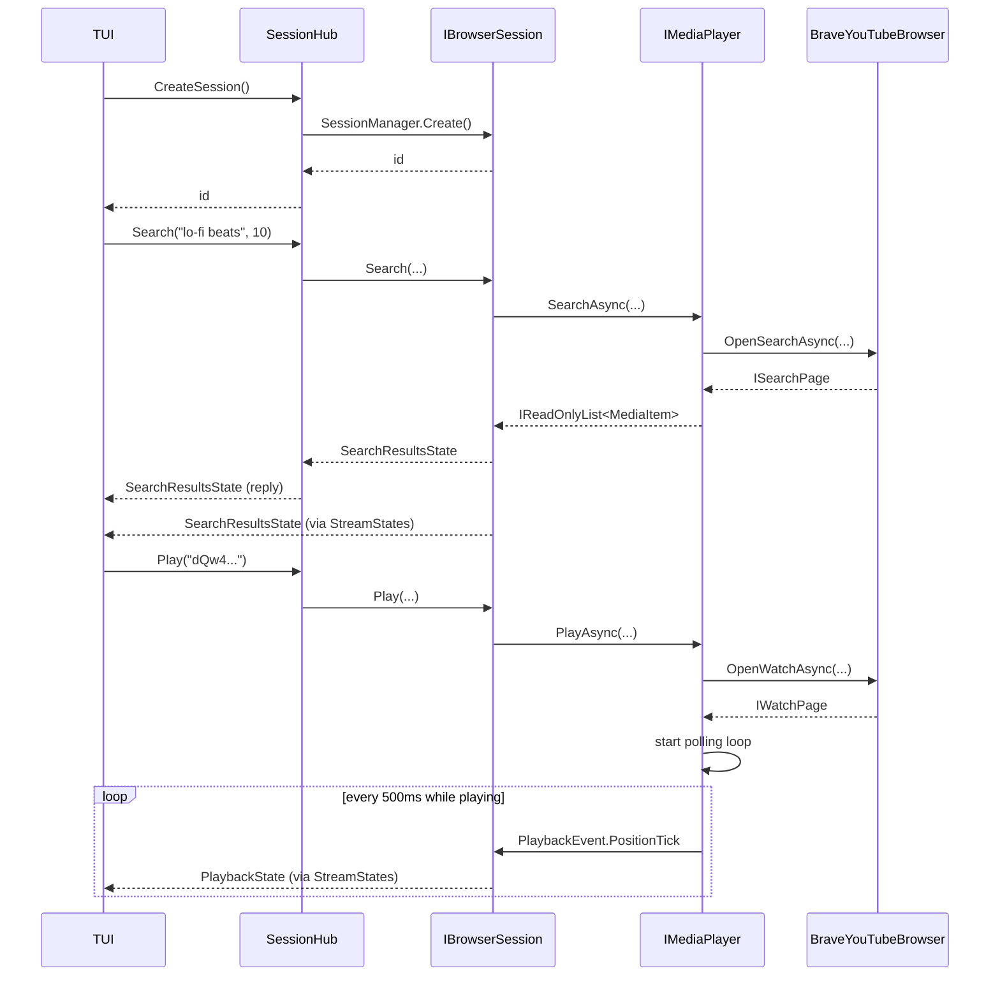
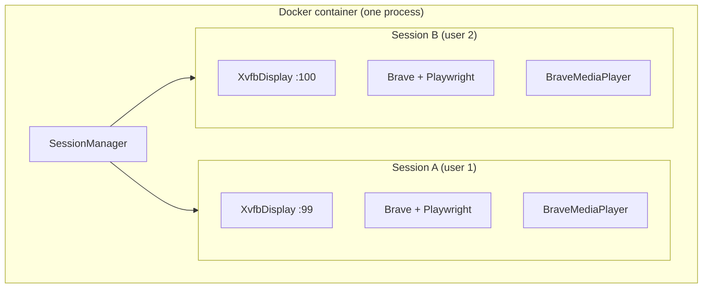
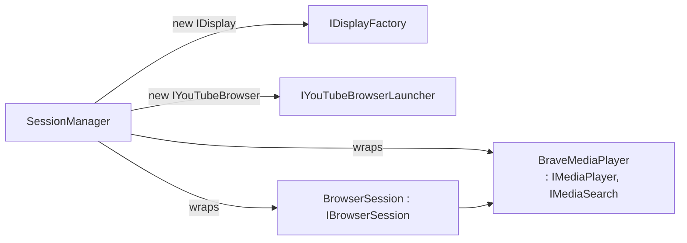
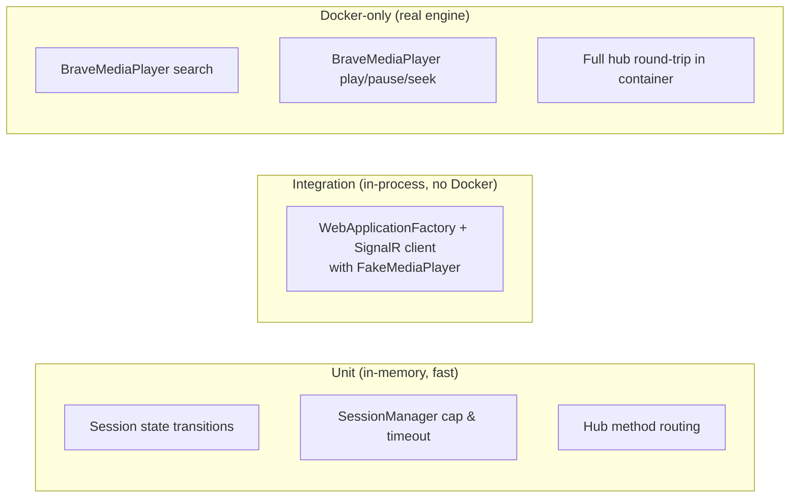

# BluKube Server — Clean Design

A focused design for the server side of BluKube. Goals:

- Small, single-purpose components.
- Clear seams for unit tests (no Playwright in domain layer) and Docker-only integration tests (real Brave engine).
- Stateful, session-oriented: the TUI is a dumb renderer; the server owns truth.
- **Per-session engine isolation**: each session owns its own Brave + Xvfb + Playwright instance. Multiple concurrent users never share a browser tab.
- Extensible: adding a new YouTube surface (e.g. channel browsing) doesn't ripple through unrelated layers.
- No language-preview ceremony (no `union`, no `static abstract` page factories).

---

## 1. Layered architecture

Four concentric layers. Lower layers know nothing about higher ones. Each layer has exactly one reason to change.



### What each layer owns

| Layer | Owns | Knows about |
|---|---|---|
| L1 Engine | Playwright, Brave, Xvfb, DOM scripts, page navigation | Nothing above |
| L2 Domain | Verbs (`PlayAsync`, `SearchAsync`), polling cadence, error mapping to domain errors | L1 |
| L3 Session | Session identity, lifecycle, snapshot fan-out, audio stream access, idle timeout | L2 |
| L4 Transport | SignalR contract, auth, REST endpoints | L3 |

The **testable seam** is L2. Hub and session logic test against fakes implementing `IMediaPlayer` / `IMediaSearch`. Real Brave is exercised only by Docker-only tests at L1/L2.

---

## 2. Engine layer — page abstraction without ceremony

We keep a per-page abstraction (so adding channel browsing later doesn't bloat one god class), but drop the `static abstract Create` factory. Pages are plain interfaces returned by the browser. The browser is the only thing that knows about Playwright.



### Adding a new page later

Adding `OpenChannelAsync` is a three-step change confined to L1:

1. Add `IChannelPage` interface.
2. Add `OpenChannelAsync` method to `IYouTubeBrowser` and implement it in `BraveYouTubeBrowser`.
3. Add a `BraveChannelPage` class with its DOM scripts.

Nothing in L2/L3/L4 changes unless you decide to expose the new capability through a domain interface.

### `IPage` lifetime

One Brave context per session, one tab (`IPage`) per session, reused across pages. `OpenSearchAsync` / `OpenWatchAsync` navigate the same tab and return a thin wrapper over that tab. Previously returned page wrappers become stale after the next navigation.

Each Brave context uses a disposable per-session user-data directory under `/var/lib/blukube/brave-profiles/sessions/<guid>`. The launcher seeds it from warmed Brave component/filter state, strips restore/cache state, adds consent cookies, and deletes it when the browser is disposed. This keeps Brave Shields effective without letting previous YouTube tabs leak into a new session.

---

## 3. Domain layer — `IMediaPlayer` and `IMediaSearch`

These are the **only** types L4 transport code sees. They have no Playwright references.

```csharp
public interface IMediaSearch
{
    Task<IReadOnlyList<MediaItem>> SearchAsync(
        string query, int limit, CancellationToken ct);
}

public interface IMediaPlayer : IAsyncDisposable
{
    Task<PlayerSnapshot> PlayAsync(string videoId, CancellationToken ct);
    Task<PlayerSnapshot> PauseAsync(CancellationToken ct);
    Task<PlayerSnapshot> ResumeAsync(CancellationToken ct);
    Task<PlayerSnapshot> SeekToAsync(TimeSpan position, CancellationToken ct);
    Task<PlayerSnapshot> SetVolumeAsync(float volume, CancellationToken ct);
    Task StopAsync(CancellationToken ct);
    IAsyncEnumerable<PlaybackEvent> Events(CancellationToken ct);
}
```

`PlayerSnapshot` is the current playback snapshot. `PlaybackEvent` is incremental: position changes and failures. The polling loop lives inside `BraveMediaPlayer`, driven by its own `CancellationTokenSource` keyed to active playback. Polling stops on `Pause`/`Stop`/`Dispose`.

Both interfaces are implemented by `BraveMediaPlayer`, which composes `IYouTubeBrowser`. They're separate interfaces so:

- A future provider (e.g. SoundCloud) can implement only `IMediaPlayer`.
- Tests can fake one without the other.

---

## 4. Session layer — thin TUI, snapshot push

The TUI is intentionally dumb: it sends typed commands and renders whatever `SessionState` arrives. The session is the state machine.

### State as a sealed record union (no `union` keyword)

```csharp
public abstract record SessionState;
public sealed record IdleState                                : SessionState;
public sealed record SearchResultsState(string Query,
        IReadOnlyList<MediaItem> Items)                       : SessionState;
public sealed record PlaybackState(string VideoId,
    TimeSpan Position, TimeSpan Duration,
    bool IsPlaying, float Volume)                         : SessionState;
public sealed record ErrorState(string Code, string Message,
        SessionState? Previous)                               : SessionState;
```

`ErrorState.Previous` lets the TUI render an error overlay without losing context — a small affordance that pays off in UX.

### State and audio streams

Command replies, state updates, and audio packets are separate flows:

| Channel | Purpose | Direction |
|---|---|---|
| Hub method return | Acknowledge a command, surface validation errors | request/reply |
| `StreamStates()` | Continuous, eventually-consistent view of `SessionState` | server -> client |
| `StreamAudio()` | Opus packets captured from the session's PulseAudio monitor | server -> client |

Hub methods return `Task` (fire-and-forget) or `Task<SessionState>` for "what does the world look like right after this command". The stream is the source of truth; the reply is a convenience for clients that want a synchronous confirmation.

### Session lifecycle = client lifecycle

Each TUI run owns exactly one server session. Starting the client creates a fresh session; closing the client, losing the SignalR connection, or pressing Ctrl+C closes that session and disposes its Brave/Xvfb/audio resources. There is no reattach flow.



`SessionManager` enforces:

- `MaxSessions` cap (default 3).
- Idle timeout as a final safety net for any session that is not otherwise closed.
- One Brave profile + Brave process + Xvfb per session, disposed on close.

---

## 5. Transport layer — typed hub methods and streams

The interactive surface is a SignalR hub. Commands are typed hub methods; long-lived state/audio flows use SignalR server streaming.

```csharp
public interface ISessionClient   // server → client
{
    Task State(SessionState state);
}

public class SessionHub : Hub<ISessionClient>
{
    // Lifecycle
    public Task<Guid> CreateSession();
    public Task CloseSession(Guid id);

    // Commands (all require the session created on this connection)
    public Task<SessionState> Search(string query, int limit);
    public Task<SessionState> Play(string videoId);
    public Task<SessionState> Pause();
    public Task<SessionState> Resume();
    public Task<SessionState> SeekTo(TimeSpan position);
    public Task<SessionState> SetVolume(float volume);

    // Read
    public Task<SessionState> GetState();
    public IAsyncEnumerable<SessionState> StreamStates(CancellationToken ct);
    public IAsyncEnumerable<byte[]> StreamAudio(CancellationToken ct);
}
```

Plus thin REST for scripting / inspection:

| Verb | Path | Purpose |
|---|---|---|
| `GET` | `/v1/sessions` | List sessions |
| `POST` | `/v1/sessions` | Create session |
| `DELETE` | `/v1/sessions/{id}` | Close session |
| `GET` | `/v1/sessions/{id}/state` | Snapshot |
| `GET` | `/health`, `/alive` | Liveness/readiness |

Auth: bearer token middleware applied to `/v1/*` and the hub. Health endpoints stay open.

---

## 6. End-to-end command flow



    Reply + stream together let clients use either pattern. The TUI subscribes once and renders state stream updates; a script can call a single command and read the reply.

---

## 7. Composition root (DI registration)

```csharp
// Engine — singletons / factories per session
services.AddSingleton<IDisplayFactory, XvfbDisplayFactory>();
services.AddSingleton<IYouTubeBrowserLauncher, BraveYouTubeBrowserLauncher>();

// Domain — created per session by the SessionManager, not via DI scope
//   (sessions outlive any HTTP request scope)
// SessionManager is the factory.
services.AddSingleton<ISessionManager, SessionManager>();

// Transport
services.AddSignalR();
services.Configure<AuthOptions>(builder.Configuration.GetSection("Auth"));
services.Configure<SessionLimits>(builder.Configuration.GetSection("SessionLimits"));
```

`SessionManager` is the only thing that constructs `BraveMediaPlayer`. It uses the engine factories to build a fresh `IDisplay`, per-session audio sink, and `IYouTubeBrowser`, wraps them in `BraveMediaPlayer`, then in `BrowserSession`, and registers the result.

Engine resources are **owned by the session, not the process**. Two users issuing `CreateSession()` get two completely independent engines:



Implications this drives:

- `XvfbDisplayFactory` must hand out unique display numbers (`:99`, `:100`, …). The factory tracks used numbers and recycles them on session close.
- Each Brave gets its own disposable user-data dir under `/var/lib/blukube/brave-profiles/sessions/<guid>`, cleaned up on dispose.
- `MaxSessions` exists primarily as a resource cap (each Brave is ~200 MB RAM); it is not a single-user assumption.
- A failure in one session's engine (Brave crash, Playwright timeout) marks that session `ErrorState` and disposes its resources — it never affects other sessions.



---

## 8. Testing strategy

Three test tiers. Each tier has a distinct purpose; nothing leaks between them.



### Fakes

- `FakeMediaPlayer : IMediaPlayer, IMediaSearch` — scripted events on a `Channel<PlaybackEvent>`, deterministic search results. Tests inject scenarios.
- `FakeYouTubeBrowser` — only used by lower-level engine tests if needed; most code tests against `IMediaPlayer` directly.

### `DockerOnlyFactAttribute`

Already in the repo. Skips when not running in the BluKube container image (detected via env var or marker file). Docker-only tests:

- Take real wall-clock time (a few seconds each).
- Use a **stable, short, license-safe** test video (a Creative Commons clip on YouTube — pinned via env var so it can be swapped).
- Assert behavioural invariants (state goes from `Paused → Playing`, position advances), never exact pixel/timing values.

---

## 9. Folder layout

```
src/BluKube.Server/
  Program.cs
  Hubs/
    SessionHub.cs
    ISessionClient.cs
  Core/
    Engine/
      Browser/
        IYouTubeBrowser.cs
        ISearchPage.cs
        IWatchPage.cs
        BraveYouTubeBrowser.cs
        YouTubeSearchPage.cs
        YouTubeWatchPage.cs
        IYouTubeBrowserLauncher.cs
        BraveYouTubeBrowserLauncher.cs
      Display/
        IDisplay.cs
        IDisplayFactory.cs
        XvfbDisplay.cs
        XvfbDisplayFactory.cs
            Audio/
                IAudioOutputDevice.cs
                PulseAudioOutputDevice.cs
                OpusEncoder.cs
    Domain/
      IMediaSearch.cs
      IMediaPlayer.cs
      PlaybackEvent.cs
      BraveMediaPlayer.cs
    Session/
        IBrowserSession.cs
        BrowserSession.cs
      ISessionManager.cs
      SessionManager.cs
  Configuration/
        AuthOptions.cs
        SessionLimits.cs
src/BluKube.Contracts/
    MediaItem.cs
    SessionState.cs
    AudioFormat.cs
```

The contracts assembly contains wire-level records shared by the server and TUI. Server domain types stay private unless they are part of that wire contract.

---

## 10. Open questions / explicit non-goals

Captured so we don't accidentally design for them:

- **Queue management**: out of scope. The player handles one selected YouTube video at a time.
- **Reattach / multiple clients per session**: out of scope. A TUI run creates one session and closing that client closes the session.
- **Multiple sessions per server**: supported. Each session = one isolated `IDisplay` + `IYouTubeBrowser` + `IMediaPlayer` + audio sink. `MaxSessions` caps total resource usage.
- **Session persistence**: out of scope. Sessions die on client exit, disconnect, idle reaping, or container shutdown.
- **HTTPS / TLS**: out of scope; reverse-proxy concern.
- **Authn beyond shared token**: out of scope.

---

## 11. Validation

The main validation commands are:

- `dotnet build BluKube.slnx`
- `set +H && dotnet test BluKube.slnx --filter 'FullyQualifiedName!~BraveMediaPlayerIntegrationTests'`
- `docker compose build && BLUKUBE_TOKEN=<token> docker compose up -d`
